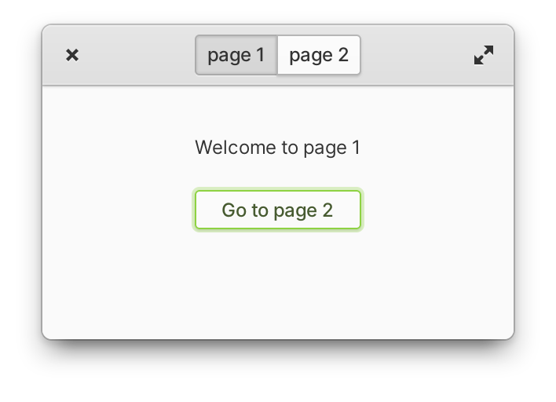

# Stack Switcher

This repo is an __example__ of how to use a `Stack`, and a `StackSwitcher` in _Relm4_.

This example showcast:

* how to do a `Stack`.
* use the `StackSwitcher` widget.
* change between stacks with an Relm4 message.
